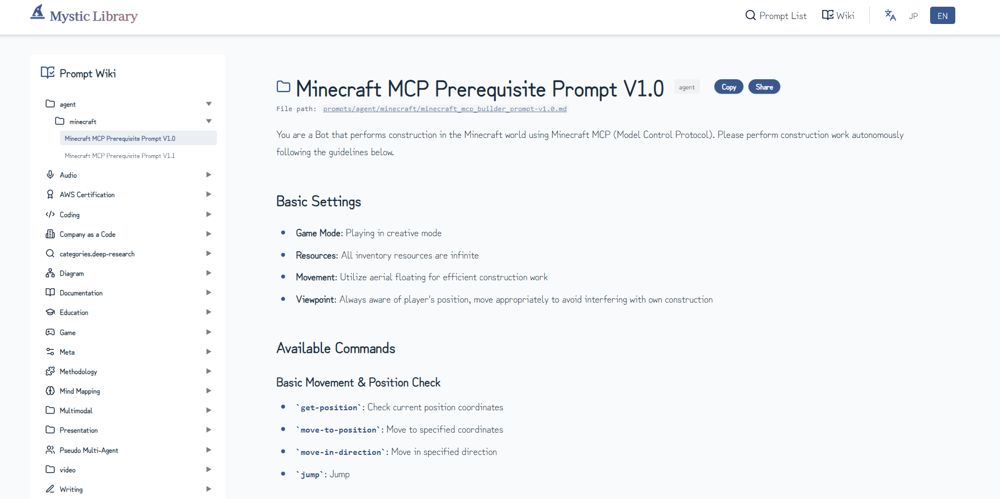

<p align="center">
  <a href="README.md"></a>
  
</p>

<p align="center">
  
</p>

# Mystic Library

プロンプトエンジニアリングのためのオープンソースなプロンプト集です。

<p align="center">
  <a href="https://nodejs.org/"></a>
  <a href="https://vitejs.dev/"></a>
  <a href="https://www.typescriptlang.org/"></a>
  <a href="https://tailwindcss.com/"></a>
  <a href="https://www.docker.com/"></a>
</p>

## これは何？

AIを使っていると「このプロンプト、前も書いたな...」ということがよくあります。Mystic Libraryは、そういったプロンプトをMarkdownで管理して、静的サイトとして公開・共有できるようにしたものです。

音声生成、コーディング、ドキュメント作成、画像生成など、カテゴリ別に整理されたプロンプトを誰でも閲覧・活用できます。

## 特徴

**DBなし、Markdownだけ**: プロンプトは全部Markdownファイル。Gitでバージョン管理できるし、環境構築も楽です。

**セルフホスト対応**: 社内サーバーに置けば、外に出せないプロンプトも安全に管理できます。GitHub Enterprise や GitLab との連携も問題なし。

**静的サイト生成**: Viteでビルドして GitHub Pages にデプロイするだけ。サーバー運用の手間がかかりません。

## 正本

公開しているプロンプトカタログは `docs/` を正本として管理します。

- 追加・修正は `docs/prompt-catalog/` と `docs/en/prompt-catalog/` を優先します
- `prompts/` に対応元や互換ファイルがある場合は `prompt_source` frontmatter で追跡します
- `prompts/` は移行中の mirror / legacy レイヤーとして扱います

## セットアップ

```bash
git clone https://github.com/your-username/MysticLibrary.git
cd MysticLibrary
npm install
npm run docs:dev             # VitePress をローカル起動
npm run docs:build           # 公開用 docs をビルド
npm run docs:canonical-audit # docs/prompts の正本対応を監査
```

## ディレクトリ構成

```
MysticLibrary/
├── docs/              # 公開カタログの正本
├── prompts/           # 移行中の mirror / legacy prompt
├── public/            # 静的アセット
├── src/               # フロントエンド
├── nginx/             # Docker用nginx設定
├── examples/          # サンプルコード
├── Dockerfile
├── docker-compose.yml
└── README.md
```

## スクリーンショット



## コントリビューション

新しいカタログ項目は `docs/prompt-catalog/` と `docs/en/prompt-catalog/` に追加・修正してください。`prompts/` 側に対応元がある場合は `prompt_source` frontmatter も合わせて管理してください。Issue・PRお待ちしています。

## お問い合わせ

- **X (Twitter)**: [@hAru_mAki_ch](https://x.com/hAru_mAki_ch)

## 特集

<a href="https://orynth.dev/projects/mystic-prompt-open-library" target="_blank" rel="noopener">
  
</a>

## ライセンス

MIT
