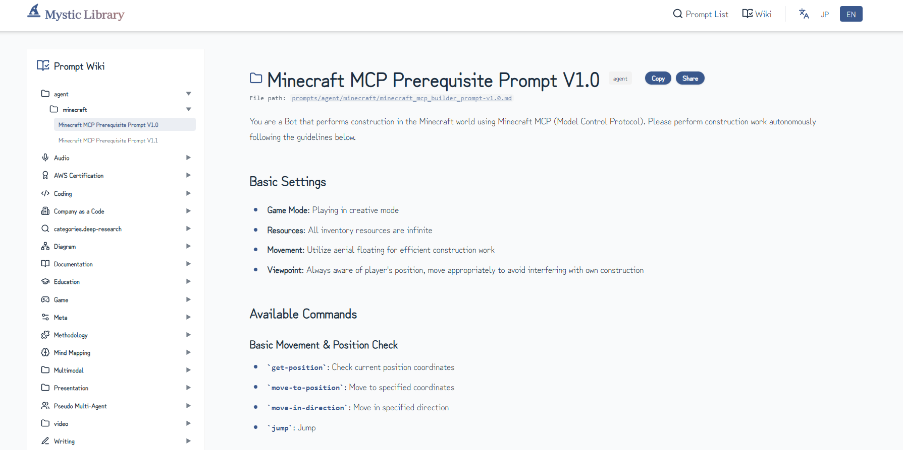

<p align="center">
  
  <a href="README.ja.md"></a>
</p>

<p align="center">
  
</p>

# Mystic Library

An open-source prompt collection for prompt engineering.

<p align="center">
  <a href="https://nodejs.org/"></a>
  <a href="https://vitejs.dev/"></a>
  <a href="https://www.typescriptlang.org/"></a>
  <a href="https://tailwindcss.com/"></a>
  <a href="https://www.docker.com/"></a>
</p>

## What is this?

When working with AI, you often find yourself thinking "I've written this prompt before...". Mystic Library is designed to manage such prompts in Markdown format and make them easy to publish and share as a static site.

Anyone can view and utilize prompts organized by categories such as audio generation, coding, documentation, image generation, and more.

## Features

**No Database, Just Markdown**: All prompts are stored as Markdown files. Version control with Git and environment setup are straightforward.

**Self-Host Ready**: Deploy on your internal server to securely manage prompts that shouldn't be exposed externally. Works seamlessly with GitHub Enterprise and GitLab.

**Static Site Generation**: Simply build with Vite and deploy to GitHub Pages. No server maintenance required.

## Setup

```bash
git clone https://github.com/your-username/MysticLibrary.git
cd MysticLibrary
npm install
npm run dev      # Start development server
npm run build    # Production build
```

## Directory Structure

```
MysticLibrary/
├── prompts/           # Prompts (organized by category)
├── public/            # Static assets
├── src/               # Frontend
├── nginx/             # nginx config for Docker
├── examples/          # Sample code
├── Dockerfile
├── docker-compose.yml
└── README.md
```

## Screenshot



## Contributing

Please add new prompts as Markdown files under `prompts/`. Issues and PRs are welcome.

## Contact

- **X (Twitter)**: [@hAru_mAki_ch](https://x.com/hAru_mAki_ch)

## Featured

<a href="https://orynth.dev/projects/mystic-prompt-open-library" target="_blank" rel="noopener">
  
</a>

## License

MIT
