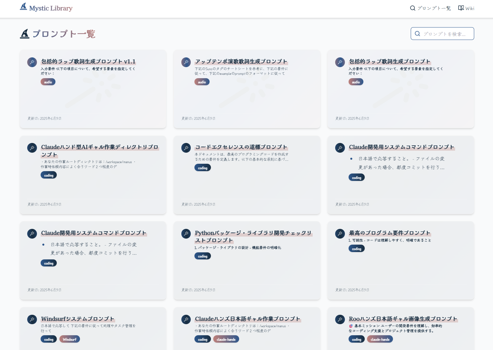

<p align="center">
  
</p>

<h1 align="center">Mystic Library</h1>
<h3 align="center">～ プロンプトエンジニアリングの魔法の世界へ ～</h3>

<p align="center">
  <!-- 技術スタックバッジ -->
  <a href="https://nodejs.org/"></a>
  <a href="https://vitejs.dev/"></a>
  <a href="https://www.typescriptlang.org/"></a>
  <a href="https://tailwindcss.com/"></a>
  <a href="https://www.docker.com/"></a>
  <a href="https://github.com/features/actions"></a>
</p>

---

## 🪄 概要

**Mystic Library** は、AIプロンプトエンジニアリングのための高品質なプロンプト集・テンプレート集を提供するオープンソースプロジェクトです。
AIと人間の創造性を最大限に引き出すための多様なプロンプトを、静的サイトとして誰でも簡単に閲覧・活用できます。

---

## ✨ 特徴

- 🗂️ **豊富なカテゴリ別プロンプト**（音声・コーディング・ドキュメント・画像生成など）
- 📝 **すべてのプロンプトはMarkdownファイルで管理・バージョン管理**
- ⚡ **静的サイト（GitHub Pages等）で高速・安全に閲覧可能**
- 🤝 **コントリビューション歓迎！誰でも新しいプロンプトを追加可能**

---

## 🚀 クイックスタート

### 1. リポジトリのクローン

```bash
git clone https://github.com/your-username/MysticLibrary.git
cd MysticLibrary
```

### 2. 依存パッケージのインストール

```bash
npm install
```

### 3. 開発サーバー起動

```bash
npm run dev
```

### 4. ビルド（静的サイト生成）

```bash
npm run build
```

---

## 📁 ディレクトリ構成

```
MysticLibrary/
├── prompts/         # プロンプトMarkdown集（カテゴリ別）
├── public/          # 静的アセット
├── src/             # フロントエンドソース
├── nginx/           # Docker用nginx設定
├── examples/        # サンプルコード
├── Dockerfile       # Dockerビルド用
├── docker-compose.yml
└── README.md
```

---

## 🖼️ スクリーンショット



---

## 📚 ドキュメント・リンク

- [プロンプト集（prompts/）](./prompts/)
- [サンプルコード（examples/）](./examples/)
- [Wiki（src/pages/Wiki.tsx）](./src/pages/Wiki.tsx)
- [プロジェクト構成・開発ガイド（今後追加予定）](#)

---

## 🛠️ 開発・コントリビューション

1. Issue・Pull Request歓迎！
2. 新しいプロンプトは `prompts/` 配下にMarkdownで追加してください。
3. 詳細なコントリビューションガイドは今後追加予定です。

---

## 📝 ライセンス

MIT License

---

## 💬 お問い合わせ

ご質問・ご要望は [GitHub Issues](https://github.com/your-username/MysticLibrary/issues) までお気軽にどうぞ。

## Contact

- **X (Twitter)**: [@hAru_mAki_ch](https://x.com/hAru_mAki_ch)

## Featured

<a href="https://orynth.dev/projects/mystic-prompt-open-library" target="_blank" rel="noopener">
  
</a>
