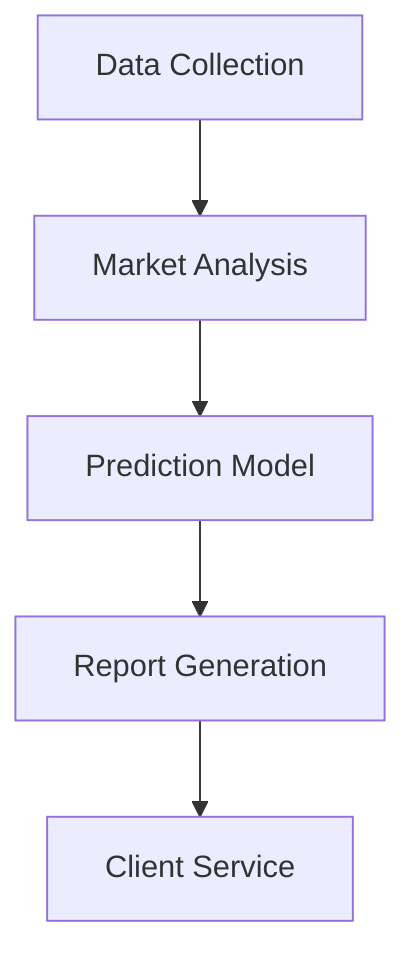

# Phidata Multi-Agent Template

## 想定用途

- Design and implement multi-agent systems with Phidata framework
- Mimic/automate organizational structures as AI agent teams
- Define collaboration and data flow between multiple AI agents

## プロンプト本文

```text
# 🤖 Phidata Multi-Agent Prompt Template

Template for automatically designing and implementing multi-agent AI systems using Phidata framework

## Project Purpose

[Describe the project purpose here]

Example: "I want to establish a consulting company that performs real estate price prediction and market analysis using AI"

## Desired Content
- Organizational structure
- Responsibility scope of each department/role
- Complete set of required AI agents
- Processing flow
- Code implementation

# Output Format

## 1. Organizational Analysis
[LLM analyzes organizational requirements and proposes optimal structure]

### 1.1 Organizational Structure
[Display department composition and hierarchy in tree format]

### 1.2 Roles and Responsibilities
[Detailed responsibility scope of each department/position]

## 2. AI Agent Design
[Identification and design of required AI agents]

### 2.1 Agent Composition
[Definition of agent types and roles]

### 2.2 Data Flow
[Collaboration and information flow between agents]

## 3. Implementation Code

```python
# Write code implementation here
```
```

## 使い方

1. Describe project purpose specifically
2. Imagine types of agents needed
3. Execute prompt to generate organizational structure and code
4. Customize generated code for use

## 入力例

```text
## Project Purpose
Want to establish a consulting company using AI for real estate price prediction and market analysis

## Desired Content
- Organizational structure
- Responsibility scope of each department/role
- Complete set of required AI agents
- Processing flow
- Code implementation
```

## 出力例

```text
## 1. Organizational Analysis

### 1.1 Organizational Structure
```
RealEstate AI Consulting
├── Market Analysis Department
│   ├── Data Science Team
│   └── Market Research Team
├── Consulting Department
│   ├── Customer Service Team
│   └── Report Creation Team
└── System Operations Department
    ├── AI Operations Team
    └── Infrastructure Management Team
```

### 1.2 Roles and Responsibilities
- Market Analysis Department
  - Data collection and preprocessing
  - Prediction model development and validation
  - Market trend analysis
[...]

## 2. AI Agent Design

### 2.1 Agent Composition
- Data Collection Agent
- Market Analysis Agent
- Prediction Model Agent
- Report Generation Agent
- Client Service Agent

### 2.2 Data Flow


## 3. Implementation Code

```python
from phi.agent import Agent
from phi.model.openai import OpenAIChat
from phi.tools.duckduckgo import DuckDuckGo
from phi.tools.yfinance import YFinanceTools
from phi.storage.agent.sqlite import SqlAgentStorage

# Data Collection Agent
data_collector = Agent(
    name="data_collector",
    role="Data Collection Specialist",
    model=OpenAIChat(id="gpt-4"),
    tools=[
        DuckDuckGo(),
        YFinanceTools(enable_all=True)
    ],
    instructions=[
        "Collect real estate market data",
        "Prioritize reliable sources",
        "Perform data preprocessing and formatting"
    ],
    storage=SqlAgentStorage(
        table_name="data_collector",
        db_file="real_estate.db"
    )
)
[...continues...]
```
```

## 注意点

- Support latest version of Phidata framework
- Clearly define data flow between agents
- Clarify roles and responsibility scope of each agent
- Configure storage settings appropriately
- Define team leader agent
