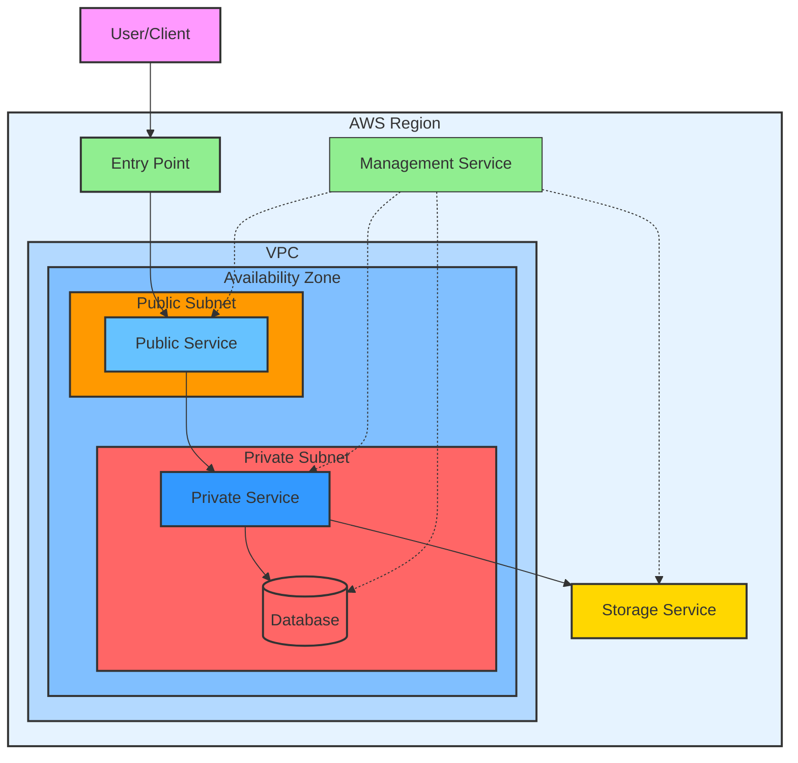

# AWS Certification Exam Guide Template

## 想定用途

- Explaining AWS certification exam questions for beginners
- Providing detailed background and concepts for questions
- Explaining why the answer is correct and why other choices are incorrect
- Offering solution strategies and specific thought processes

## プロンプト本文

```text
# AWS Certification Exam Question Explanation and Solution Strategy

## Input

### Question Text
【Enter question text here】

### Choices
- **A**: 【Enter choice A content】
- **B**: 【Enter choice B content】
- **C**: 【Enter choice C content】
- **D**: 【Enter choice D content】

### Answer
**Correct**: 【Enter correct choice here】

---

## Question Overview

【Summarize the question. Explain the topic and scenario in a beginner-friendly way】

## Beginner-Friendly Explanation

### Question Background
- 【Briefly explain the situation and context. Replace technical terms with understandable language where possible】

### What's Being Asked
- 【Clearly list in bullet points what the question is asking for】

### Key Points
- 【Explain important points and concepts for solving the question】

## Answer and Explanation

### Correct Answer
**【Correct choice】**: 【Brief explanation of correct answer】

### Detailed Explanation
【Explain in detail why this is the correct answer. Explain step-by-step so beginners can understand】

### Why Other Choices Are Incorrect
- **A**: 【Explain why choice A is incorrect】
- **B**: 【Explain why choice B is incorrect】
- **C**: 【Explain why choice C is incorrect】
- **D**: 【Explain why choice D is incorrect】 (omit if correct)

## Solution Strategy

1. **Keyword Extraction**
   - 【List important keywords and phrases from the question】

2. **Requirement Organization**
   - 【Organize required items from the question and clarify what needs to be solved】

3. **Understanding Related AWS Services**
   - 【Explain related AWS services and features, summarizing their characteristics】

4. **Choice Analysis**
   - 【Analyze pros/cons of each choice and evaluate fit with requirements】

5. **Latest Service Verification**
   - 【As needed, verify if new AWS services or features are relevant】

6. **Elimination Method Application**
   - 【Explain how to eliminate inappropriate choices and narrow down to best answer】

7. **AWS Best Practices Consideration**
   - 【Select optimal solution based on AWS recommendations and best practices】

---

## Specific Thought Process

【Describe the flow of thinking for problem solving in detail. Explain thoroughly so beginners can follow the same steps】

---

## Example Question

**Example**:

### Question Text
【Enter a new question text. Content related to the original question's answer, for beginners to deepen understanding】

### Choices
- **A**: 【Enter choice A content】
- **B**: 【Enter choice B content】
- **C**: 【Enter choice C content】
- **D**: 【Enter choice D content】

### Answer
**Correct**: 【Enter correct choice for example】

### Explanation
【Explain in detail why this answer is correct. Also show relationship to original question】

---

## Related Resources

- [Link to AWS official documentation](#)
- [Link to related whitepapers and blog posts](#)

---

## Choice Comparison Table

| Requirement/Feature | Choice A(XXX) | Choice B(XXX) | Choice C(XXX) | Choice D(XXX) |
|----------|:--------:|:--------:|:--------:|:--------:|
| Requirement 1    | ✅ / ❌  | ✅ / ❌  | ✅ / ❌  | ✅ / ❌  |
| Requirement 2    | ✅ / ❌  | ✅ / ❌  | ✅ / ❌  | ✅ / ❌  |
| Requirement 3    | ✅ / ❌  | ✅ / ❌  | ✅ / ❌  | ✅ / ❌  |
| Requirement 4    | ✅ / ❌  | ✅ / ❌  | ✅ / ❌  | ✅ / ❌  |

---

## Architecture Diagram

The following diagram shows the architecture related to the question scenario. Use as reference for deeper understanding.
Make nodes colorful for visual understanding.



## 使い方

1. Paste AWS certification exam question in input field
2. Specify correct choice
3. Generate detailed explanation following the prompt

## 入力例

```text
### Question Text
You want sensitive data stored in Amazon S3 to be accessible only from EC2 instances in a VPC. What is the optimal configuration to maximize security?

### Choices
- A: Make S3 bucket public and restrict by IP address
- B: Make S3 bucket private and use VPC endpoint
- C: Make S3 bucket public and restrict with IAM policy
- D: Distribute S3 bucket via CloudFront

### Answer
**Correct**: B
```

## 出力例

```text
## Question Overview
A problem considering configuration to allow access to S3 bucket only from EC2 instances in VPC and maximize security.

## Beginner-Friendly Explanation

### Question Background
S3 is originally a service accessible from the internet, but there are cases where you want to allow access only from resources in VPC.

### What's Being Asked
- Allow access only from EC2 instances in VPC
- Maximize security

### Key Points
- Utilizing VPC endpoint (gateway type)
- Implementing private communication
[Detailed explanation follows...]
```

## 注意点

- Include explanations of technical terms for beginners
- Reflect latest AWS service information
- Use diagrams and tables for visual understanding
- Deepen understanding through example questions
