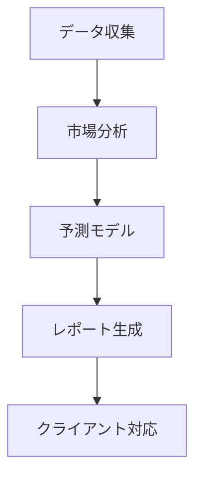

# Phidataマルチエージェント テンプレート

## 想定用途

- Phidataフレームワークでマルチエージェントシステムを設計・実装する
- 組織構造をAIエージェントチームとして模倣・自動化する
- 複数のAIエージェントの連携とデータフローを定義する

## プロンプト本文

```text
# 🤖 Phidata マルチエージェント プロンプトテンプレート

Phidataフレームワークを使用したマルチエージェントAIシステムの設計・実装を自動生成するためのテンプレート

## プロジェクトの目的

[ここにプロジェクトの目的を記載してください]

例: "AIを活用した不動産価格予測と市場分析を行うコンサルティング会社を設立したい"

## 生成して欲しい内容
- 組織構造
- 各部署/役割の責任範囲
- 必要なAIエージェント一式
- 処理フロー
- コード実装

# 出力フォーマット

## 1. 組織分析
[LLMが組織要件を分析し、最適な構造を提案]

### 1.1 組織構造
[部署構成と階層関係をツリー形式で表示]

### 1.2 役割と責任
[各部署・ポジションの詳細な責任範囲]

## 2. AIエージェント設計
[必要なAIエージェントの特定と設計]

### 2.1 エージェント構成
[エージェントの種類と役割の定義]

### 2.2 データフロー
[エージェント間の連携と情報の流れ]

## 3. 実装コード

```python
# ここにコード実装を記載
```
```

## 使い方

1. プロジェクトの目的を具体的に記述する
2. 必要なエージェントの種類をイメージする
3. プロンプトを実行して組織構造とコードを生成する
4. 生成されたコードをカスタマイズして使用する

## 入力例

```text
## プロジェクトの目的
AIを活用した不動産価格予測と市場分析を行うコンサルティング会社を設立したい

## 生成して欲しい内容
- 組織構造
- 各部署/役割の責任範囲
- 必要なAIエージェント一式
- 処理フロー
- コード実装
```

## 出力例

```text
## 1. 組織分析

### 1.1 組織構造
```
RealEstate AI Consulting
├── 市場分析部門
│   ├── データサイエンスチーム
│   └── マーケットリサーチチーム
├── コンサルティング部門
│   ├── 顧客対応チーム
│   └── レポート作成チーム
└── システム運用部門
    ├── AI運用チーム
    └── インフラ管理チーム
```

### 1.2 役割と責任
- 市場分析部門
  - データ収集と前処理
  - 予測モデルの開発と検証
  - 市場トレンド分析
[...]

## 2. AIエージェント設計

### 2.1 エージェント構成
- データ収集エージェント
- 市場分析エージェント
- 予測モデルエージェント
- レポート生成エージェント
- クライアント対応エージェント

### 2.2 データフロー


## 3. 実装コード

```python
from phi.agent import Agent
from phi.model.openai import OpenAIChat
from phi.tools.duckduckgo import DuckDuckGo
from phi.tools.yfinance import YFinanceTools
from phi.storage.agent.sqlite import SqlAgentStorage

# データ収集エージェント
data_collector = Agent(
    name="data_collector",
    role="Data Collection Specialist",
    model=OpenAIChat(id="gpt-4"),
    tools=[
        DuckDuckGo(),
        YFinanceTools(enable_all=True)
    ],
    instructions=[
        "不動産市場データを収集",
        "信頼性の高いソースを優先",
        "データの前処理と整形を行う"
    ],
    storage=SqlAgentStorage(
        table_name="data_collector",
        db_file="real_estate.db"
    )
)
[...続く...]
```
```

## 注意点

- Phidataフレームワークの最新バージョンに対応する
- エージェント間のデータフローを明確に定義する
- 各エージェントの役割と責任範囲を明確にする
- ストレージ設定を適切に構成する
- チームリーダーとなるエージェントを定義する
