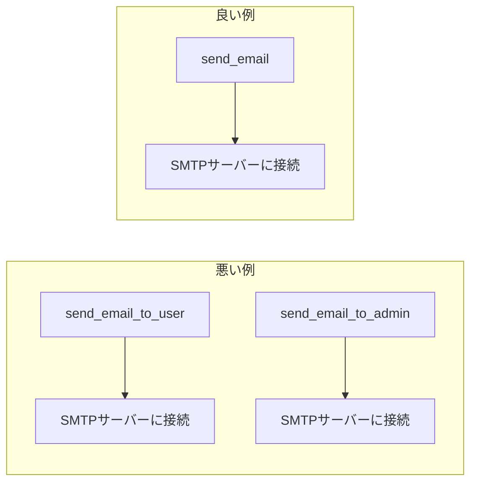
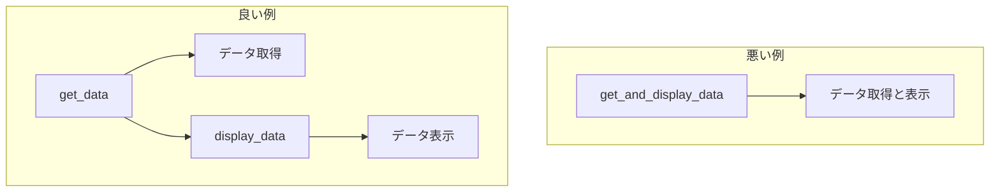
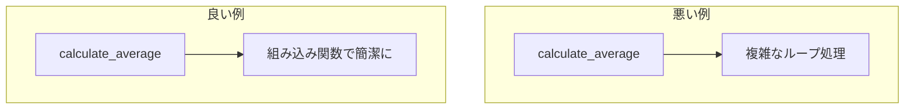
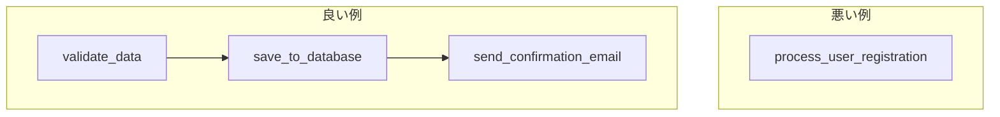
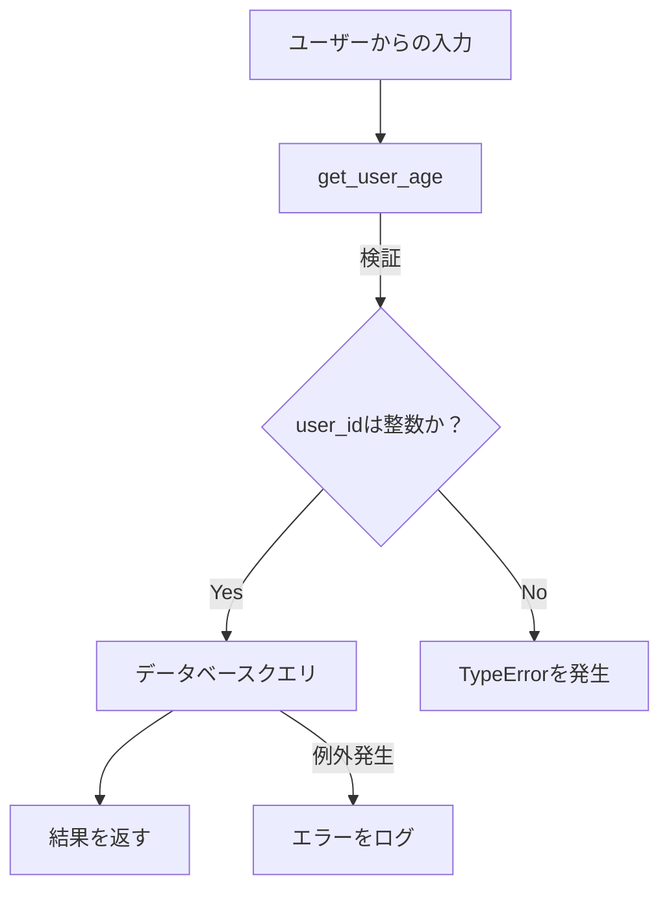
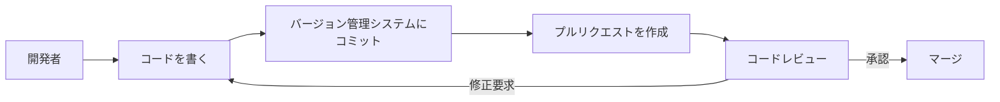
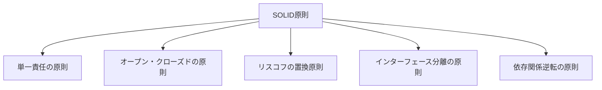

> このページは prompts ソースツリーから自動生成されています。
> ソース: `prompts/coding/BEST_PROGRAMMING_PRACTICES_REQUIREMENTS_JA_JP.md`
> 英語版: [EN](/en/coding/BEST_PROGRAMMING_PRACTICES_REQUIREMENTS_JA)

# コードエクセレンスの道標プロンプト

本ドキュメントは、最高のプログラミングコードを作成するための要件を定義します。以下の基本的な原則に基づき、コードの品質と開発効率を向上させます。

---

## 1. DRY（Don't Repeat Yourself）

**要件**:

- **コードの再利用性**: 同一または類似のコードを繰り返さず、共通部分を関数やモジュールとしてまとめる。
- **メンテナンス性向上**: 一箇所の修正で全体に反映されるようにし、保守作業を効率化する。

**具体例**:

悪い例：

```python
def send_email_to_user(user_email):
    smtp_server = "smtp.example.com"
    port = 587
    # メール送信処理
    pass

def send_email_to_admin(admin_email):
    smtp_server = "smtp.example.com"
    port = 587
    # 同じメール送信処理
    pass
```

良い例：

```python
def send_email(recipient_email):
    smtp_server = "smtp.example.com"
    port = 587
    # 共通のメール送信処理
    pass
```

**Mermaidによる可視化**:



---

## 2. 責務の分離（Separation of Concerns）

**要件**:

- **モジュール化**: 各関数やクラスは単一の責務に限定し、異なる機能を混在させない。
- **可読性と保守性の向上**: コードの構造を明確にし、他の開発者にも理解しやすくする。

**具体例**:

```python
# 悪い例：データ取得と表示が混在
def get_and_display_data():
    data = fetch_data()
    print("Data:", data)

# 良い例：責務を分離
def get_data():
    return fetch_data()

def display_data(data):
    print("Data:", data)

# 使用例
data = get_data()
display_data(data)
```

**Mermaidによる可視化**:



---

## 3. KISS（Keep It Simple, Stupid）

**要件**:

- **シンプルさの追求**: コードを可能な限り簡潔にし、不要な複雑性を排除する。
- **効率的な実装**: 理解とデバッグを容易にするため、明瞭なコードを書く。

**具体例**:

```python
# 悪い例：複雑なアルゴリズムを自作
def calculate_average(numbers):
    total = 0
    count = 0
    for number in numbers:
        total += number
        count += 1
    average = total / count
    return average

# 良い例：組み込み関数を活用
def calculate_average(numbers):
    return sum(numbers) / len(numbers)
```

**Mermaidによる可視化**:



---

## 4. 分割統治（Divide and Conquer）

**要件**:

- **問題の分割**: 大きな問題を小さな部分に分割し、個別に解決する。
- **段階的な開発**: 各部分を独立してテスト・デバッグ可能にする。

**具体例**:

```python
# 悪い例：一つの関数で全てを処理
def process_user_registration(data):
    # データバリデーション
    # データベースへの保存
    # 確認メールの送信
    pass

# 良い例：機能ごとに分割
def validate_data(data):
    # バリデーション処理
    pass

def save_to_database(validated_data):
    # データ保存処理
    pass

def send_confirmation_email(user_email):
    # メール送信処理
    pass

# 使用例
validated_data = validate_data(data)
save_to_database(validated_data)
send_confirmation_email(validated_data['email'])
```

**Mermaidによる可視化**:



---

## 5. 防御的プログラミング（Defensive Programming）

**要件**:

- **入力の検証**: 関数やメソッドに渡されるデータを常に検証する。
- **エラーハンドリング**: 予期せぬエラーや例外に対して適切な処理を行う。
- **セキュリティ対策**: 潜在的な脆弱性を考慮し、攻撃に対する防御策を実装する。

**具体例**:

```python
# 悪い例：入力の検証なし
def get_user_age(user_id):
    age = database.query(f"SELECT age FROM users WHERE id = {user_id}")
    return age

# 良い例：入力の検証とエラーハンドリング
def get_user_age(user_id):
    if not isinstance(user_id, int):
        raise TypeError("User ID must be an integer")
    try:
        age = database.query("SELECT age FROM users WHERE id = %s", (user_id,))
        return age
    except DatabaseError as e:
        log_error(e)
        raise
```

**Mermaidによる可視化**:



---

## 6. YAGNI（You Aren't Gonna Need It）

**要件**:

- **不要な機能の排除**: 現在必要でない機能やコードを追加しない。
- **シンプルさの維持**: 将来の要件を過度に予測せず、現在の要件に集中する。

**具体例**:

```python
# 悪い例：将来必要かもしれない機能を追加
def calculate_total(price, tax, discount=0, currency='USD', apply_coupon=False):
    # 複雑な計算処理
    pass

# 良い例：現在の要件に焦点を当てる
def calculate_total(price, tax):
    return price + tax
```

---

## 7. コードの可読性とドキュメンテーション

**要件**:

- **明確な命名**: 変数名や関数名はその役割を明確に示すものにする。
- **コメントとドキュメンテーション**: 必要に応じてコメントを追加し、コードの目的や動作を説明する。

**具体例**:

```python
# 悪い例：不明瞭な変数名とコメントなし
def f(x):
    return x * 0.05

# 良い例：明確な命名とコメント
def calculate_sales_tax(amount):
    """売上税を計算する関数"""
    return amount * 0.05
```

---

## 8. テスト駆動開発（TDD）とユニットテスト

**要件**:

- **ユニットテストの作成**: 各機能に対してテストを作成し、コードの信頼性を高める。
- **テスト駆動開発の推奨**: まずテストを書いてからコードを書くことで、要件に沿った実装を確保する。

**具体例**:

```python
import unittest

class TestCalculateTotal(unittest.TestCase):
    def test_calculate_total(self):
        self.assertEqual(calculate_total(100, 5), 105)

if __name__ == '__main__':
    unittest.main()
```

---

## 9. バージョン管理とコードレビュー

**要件**:

- **バージョン管理の使用**: Gitなどのバージョン管理システムを使用してコードの変更履歴を管理する。
- **コードレビューの実施**: 他の開発者によるレビューを通じてコードの品質を向上させる。

**Mermaidによる可視化**:



---

## 10. SOLID原則

**要件**:

- **単一責任の原則（SRP）**: クラスやモジュールは一つの責務を持つべき。
- **オープン・クローズドの原則（OCP）**: ソフトウェアは拡張に対して開いており、変更に対して閉じているべき。
- **リスコフの置換原則（LSP）**: 派生クラスは基底クラスと置換可能であるべき。
- **インターフェース分離の原則（ISP）**: 特定のクライアントに特化した小さなインターフェースを作るべき。
- **依存関係逆転の原則（DIP）**: 高水準モジュールは低水準モジュールに依存すべきでない。

**Mermaidによる可視化**:



---

以上の要件を満たすことで、効率的でメンテナンス性が高く、信頼性のある最高のプログラミングコードを実現します。

---
