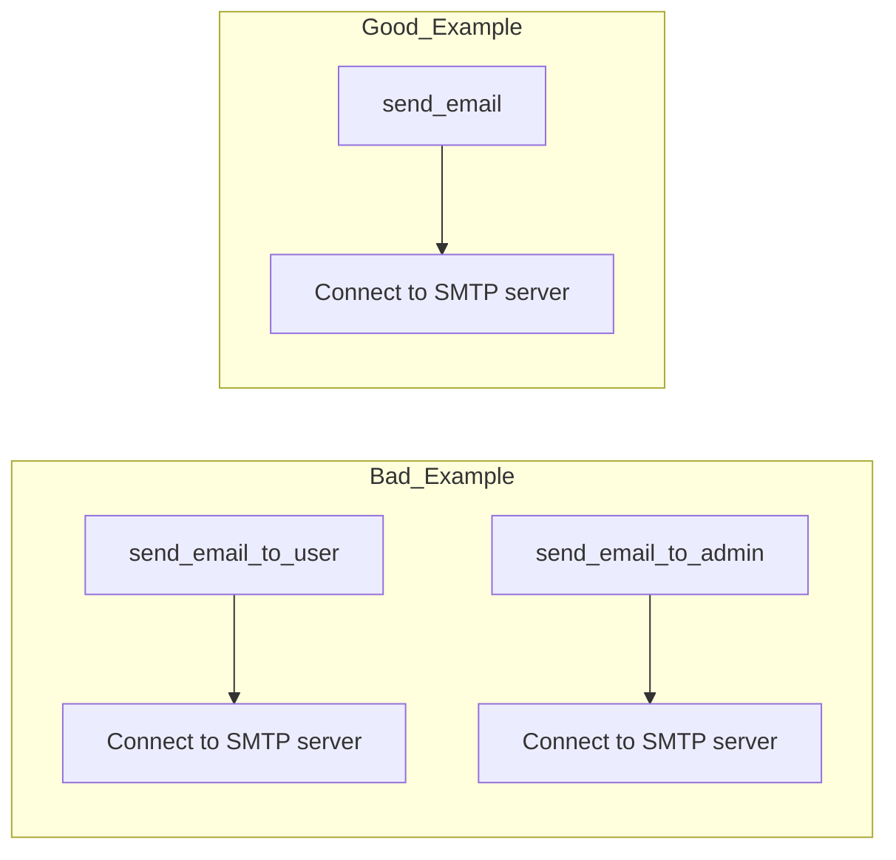
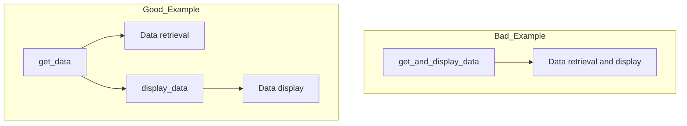
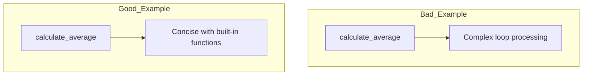
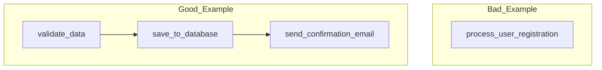
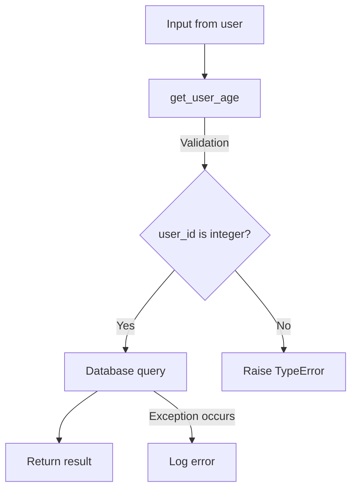
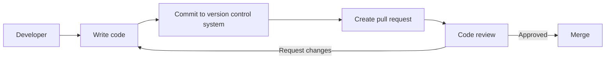
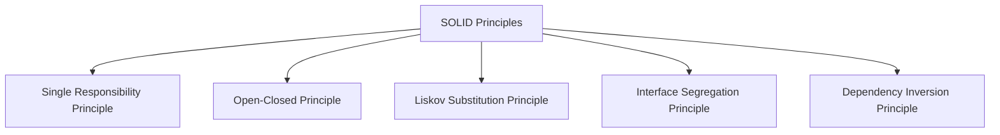

> This page is generated from the prompts source tree.
> Source: `prompts/coding/BEST_PROGRAMMING_PRACTICES_REQUIREMENTS_JA_EN.md`
> Japanese: [JA](/coding/BEST_PROGRAMMING_PRACTICES_REQUIREMENTS_JA)

# Guideposts to Code Excellence Prompt

This document defines requirements for creating the best programming code. Based on the following fundamental principles, we improve code quality and development efficiency.

---

## 1. DRY (Don't Repeat Yourself)

**Requirements**:

- **Code Reusability**: Don't repeat identical or similar code; consolidate common parts into functions or modules.
- **Improved Maintainability**: Make a single fix reflect throughout to streamline maintenance work.

**Concrete Examples**:

Bad example:

```python
def send_email_to_user(user_email):
    smtp_server = "smtp.example.com"
    port = 587
    # Email sending process
    pass

def send_email_to_admin(admin_email):
    smtp_server = "smtp.example.com"
    port = 587
    # Same email sending process
    pass
```

Good example:

```python
def send_email(recipient_email):
    smtp_server = "smtp.example.com"
    port = 587
    # Common email sending process
    pass
```

**Visualization with Mermaid**:



---

## 2. Separation of Concerns

**Requirements**:

- **Modularization**: Each function and class should be limited to a single responsibility and not mix different functionalities.
- **Improved Readability and Maintainability**: Clarify code structure to make it easy for other developers to understand.

**Concrete Examples**:

```python
# Bad example: Data retrieval and display mixed
def get_and_display_data():
    data = fetch_data()
    print("Data:", data)

# Good example: Separate concerns
def get_data():
    return fetch_data()

def display_data(data):
    print("Data:", data)

# Usage example
data = get_data()
display_data(data)
```

**Visualization with Mermaid**:



---

## 3. KISS (Keep It Simple, Stupid)

**Requirements**:

- **Pursuit of Simplicity**: Keep code as concise as possible and eliminate unnecessary complexity.
- **Efficient Implementation**: Write clear code to facilitate understanding and debugging.

**Concrete Examples**:

```python
# Bad example: Creating complex algorithms yourself
def calculate_average(numbers):
    total = 0
    count = 0
    for number in numbers:
        total += number
        count += 1
    average = total / count
    return average

# Good example: Utilizing built-in functions
def calculate_average(numbers):
    return sum(numbers) / len(numbers)
```

**Visualization with Mermaid**:



---

## 4. Divide and Conquer

**Requirements**:

- **Problem Division**: Split large problems into smaller parts and solve them individually.
- **Phased Development**: Make each part independently testable and debuggable.

**Concrete Examples**:

```python
# Bad example: Processing everything in one function
def process_user_registration(data):
    # Data validation
    # Save to database
    # Send confirmation email
    pass

# Good example: Split by function
def validate_data(data):
    # Validation process
    pass

def save_to_database(validated_data):
    # Data saving process
    pass

def send_confirmation_email(user_email):
    # Email sending process
    pass

# Usage example
validated_data = validate_data(data)
save_to_database(validated_data)
send_confirmation_email(validated_data['email'])
```

**Visualization with Mermaid**:



---

## 5. Defensive Programming

**Requirements**:

- **Input Validation**: Always validate data passed to functions or methods.
- **Error Handling**: Properly handle unexpected errors and exceptions.
- **Security Measures**: Consider potential vulnerabilities and implement defenses against attacks.

**Concrete Examples**:

```python
# Bad example: No input validation
def get_user_age(user_id):
    age = database.query(f"SELECT age FROM users WHERE id = {user_id}")
    return age

# Good example: Input validation and error handling
def get_user_age(user_id):
    if not isinstance(user_id, int):
        raise TypeError("User ID must be an integer")
    try:
        age = database.query("SELECT age FROM users WHERE id = %s", (user_id,))
        return age
    except DatabaseError as e:
        log_error(e)
        raise
```

**Visualization with Mermaid**:



---

## 6. YAGNI (You Aren't Gonna Need It)

**Requirements**:

- **Eliminate Unnecessary Features**: Don't add features or code that aren't currently needed.
- **Maintain Simplicity**: Don't over-predict future requirements; focus on current requirements.

**Concrete Examples**:

```python
# Bad example: Adding features that might be needed in the future
def calculate_total(price, tax, discount=0, currency='USD', apply_coupon=False):
    # Complex calculation process
    pass

# Good example: Focus on current requirements
def calculate_total(price, tax):
    return price + tax
```

---

## 7. Code Readability and Documentation

**Requirements**:

- **Clear Naming**: Variable and function names should clearly indicate their role.
- **Comments and Documentation**: Add comments as needed to explain code purpose and behavior.

**Concrete Examples**:

```python
# Bad example: Unclear variable names and no comments
def f(x):
    return x * 0.05

# Good example: Clear naming and comments
def calculate_sales_tax(amount):
    """Function to calculate sales tax"""
    return amount * 0.05
```

---

## 8. Test-Driven Development (TDD) and Unit Testing

**Requirements**:

- **Create Unit Tests**: Create tests for each function to increase code reliability.
- **Recommend TDD**: Write tests first, then write code to ensure implementation meets requirements.

**Concrete Examples**:

```python
import unittest

class TestCalculateTotal(unittest.TestCase):
    def test_calculate_total(self):
        self.assertEqual(calculate_total(100, 5), 105)

if __name__ == '__main__':
    unittest.main()
```

---

## 9. Version Control and Code Review

**Requirements**:

- **Use Version Control**: Use version control systems like Git to manage code change history.
- **Conduct Code Reviews**: Improve code quality through reviews by other developers.

**Visualization with Mermaid**:



---

## 10. SOLID Principles

**Requirements**:

- **Single Responsibility Principle (SRP)**: Classes and modules should have one responsibility.
- **Open-Closed Principle (OCP)**: Software should be open for extension and closed for modification.
- **Liskov Substitution Principle (LSP)**: Derived classes should be substitutable for base classes.
- **Interface Segregation Principle (ISP)**: Create small interfaces specific to particular clients.
- **Dependency Inversion Principle (DIP)**: High-level modules should not depend on low-level modules.

**Visualization with Mermaid**:



---

By meeting the above requirements, we achieve efficient, highly maintainable, and reliable best programming code.

---
