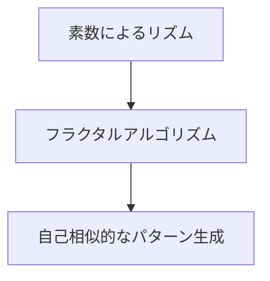
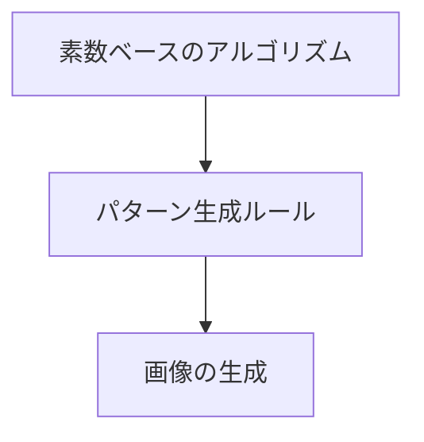

> このページは prompts ソースツリーから自動生成されています。
> ソース: `prompts/image/PRIME-NUMBER-THEORY-IMAGE-GENERATION-AI-CONCEPT_JP.md`

# 素数理論を活用した画像生成AIの概念体系

---

## 目次

1. [はじめに](#はじめに)
2. [素数理論の基本概念](#1-素数理論の基本概念)
   - [素数の特徴](#素数の特徴)
3. [素数理論を活かした画像生成AIのアイデア](#2-素数理論を活かした画像生成aiのアイデア)
   - [2.1 構造とランダム性の組み合わせ](#21-構造とランダム性の組み合わせ)
   - [2.2 フラクタル的な構造の生成](#22-フラクタル的な構造の生成)
   - [2.3 色や形のリズムに素数を利用](#23-色や形のリズムに素数を利用)
   - [2.4 アルゴリズム的な生成パターン](#24-アルゴリズム的な生成パターン)
4. [素数理論と画像生成AIの本質的な結びつき](#3-素数理論と画像生成aiの本質的な結びつき)
   - [予測不可能性と創造性](#予測不可能性と創造性)
   - [秩序とカオスの融合](#秩序とカオスの融合)
   - [人間の認知との相互作用](#人間の認知との相互作用)
5. [まとめ](#まとめ)

---

## はじめに

素数と画像生成AIを組み合わせることで、新たな視覚表現やデザインパターンを生み出すアイデアが提案されています。本稿では、その概念を体系化し、具体的な応用方法や理論的な結びつきについて詳しく解説します。

---

## 1. 素数理論の基本概念

### 素数の特徴

**素数**とは、1と自分自身以外では割り切れない自然数のことです。例として、2、3、5、7、11、13などがあります。素数の主な特徴は以下の通りです。

- **非周期性**: 素数の出現には一定のパターンがなく、ランダム性が含まれています。
- **単純さと複雑さの共存**: 定義は単純であるものの、その分布や性質は非常に複雑です。

この「単純な定義に基づく複雑な分布」という特徴は、画像生成において新たな視覚的パターンやランダム性を提供する可能性があります。

---

## 2. 素数理論を活かした画像生成AIのアイデア

### 2.1 構造とランダム性の組み合わせ

素数の分布を利用して、ランダム性と規則性を併せ持つデザインパターンを生成できます。

**応用例**:

- キャンバス上に素数に対応する位置に点や形状を配置する。
- 素数列を利用して、要素の間隔や大きさを決定し、非周期的な模様を作成。

**Mermaidによる視覚化**:

### 2.2 フラクタル的な構造の生成

素数のリズムや分布を活用して、自己相似性を持つフラクタル構造を生成します。

**応用例**:

- 素数列を用いて各レイヤーの複雑さやサイズをコントロールするフラクタル図形の生成。
- 自然界の形状（木、葉、山など）を模倣するアルゴリズムに素数を取り入れ、非対称で有機的なパターンを再現。

**Mermaidによる視覚化**:

### 2.3 色や形のリズムに素数を利用

色や形状の変化に素数の規則を応用し、ランダムな美しさを持つ画像を作成します。

**応用例**:

- 素数に基づいて色のグラデーションや色相の変化を設定。
- 形状やオブジェクトの大きさ・位置を素数を用いて不規則に配置し、ダイナミックなデザインを生成。

**Mermaidによる視覚化**:

### 2.4 アルゴリズム的な生成パターン

素数をベースとしたアルゴリズムを活用し、独自の規則性を持つパターンを生成します。

**応用例**:

- 素数分解を利用してピクセルを配置し、ユニークなテクスチャやモザイクを作成。
- 素数を用いたグリッドシステムで視覚的なリズムを生み出す。

**Mermaidによる視覚化**:

---

## 3. 素数理論と画像生成AIの本質的な結びつき

### 予測不可能性と創造性

素数の分布は予測不可能であり、これを利用することで従来の規則的なデザインにはない「意外性」や「偶発性」を作品に取り入れられます。

### 秩序とカオスの融合

素数は単純な法則に基づきながら、その出現にはカオスが伴います。この特性を画像生成に応用することで、規則性と不規則性のバランスが取れた調和のあるデザインが可能となります。

### 人間の認知との相互作用

人間はパターンを認識する能力を持ち、素数のような複雑で非周期的な構造は独特の印象を与えます。これにより、ユーザーに新たな視覚体験を提供できます。

---

## まとめ

素数理論を画像生成AIに取り入れることで、既存のデザイン手法にはない独自性と創造性を持つ作品を生み出すことが可能です。さらに、ここに独自のフレームワークを組み合わせることで、唯一無二のプロンプトワークが実現できるでしょう。
