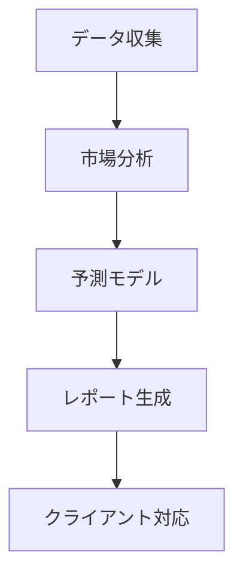

## プロジェクトの目的
[ここにプロジェクトの目的を記載してください]

例: "AIを活用した不動産価格予測と市場分析を行うコンサルティング会社を設立したい"

## 生成して欲しい内容
- 組織構造
- 各部署/役割の責任範囲
- 必要なAIエージェント一式
- 処理フロー
- コード実装

# 出力フォーマット

## 1. 組織分析
[LLMが組織要件を分析し、最適な構造を提案]

### 1.1 組織構造
[部署構成と階層関係をツリー形式で表示]

### 1.2 役割と責任
[各部署・ポジションの詳細な責任範囲]

## 2. AIエージェント設計
[必要なAIエージェントの特定と設計]

### 2.1 エージェント構成
[エージェントの種類と役割の定義]

### 2.2 データフロー
[エージェント間の連携と情報の流れ]

## 3. 実装コード

```python
# ここにコード実装を記載
```

## 実装例

以下は、指定された目的に基づいてLLMが生成する出力例です：

````markdown
入力:
"AIを活用した不動産価格予測と市場分析を行うコンサルティング会社を設立したい"

出力:

## 1. 組織分析

### 1.1 組織構造
```
RealEstate AI Consulting
├── 市場分析部門
│   ├── データサイエンスチーム
│   └── マーケットリサーチチーム
├── コンサルティング部門
│   ├── 顧客対応チーム
│   └── レポート作成チーム
└── システム運用部門
    ├── AI運用チーム
    └── インフラ管理チーム
```

### 1.2 役割と責任
- 市場分析部門
  - データ収集と前処理
  - 予測モデルの開発と検証
  - 市場トレンド分析
- コンサルティング部門
  - 顧客要件の分析
  - レポート作成と提案
  - プレゼンテーション
- システム運用部門
  - AIシステムの保守運用
  - インフラストラクチャの管理
  - セキュリティ対策

## 2. AIエージェント設計

### 2.1 エージェント構成
- データ収集エージェント
- 市場分析エージェント
- 予測モデルエージェント
- レポート生成エージェント
- クライアント対応エージェント

### 2.2 データフロー


## 3. 実装コード

```python
from phi.agent import Agent
from phi.model.openai import OpenAIChat
from phi.tools.duckduckgo import DuckDuckGo
from phi.tools.yfinance import YFinanceTools
from phi.storage.agent.sqlite import SqlAgentStorage

# データ収集エージェント
data_collector = Agent(
    name="data_collector",
    role="Data Collection Specialist",
    model=OpenAIChat(id="gpt-4"),
    tools=[
        DuckDuckGo(),
        YFinanceTools(enable_all=True)
    ],
    instructions=[
        "不動産市場データを収集",
        "信頼性の高いソースを優先",
        "データの前処理と整形を行う"
    ],
    storage=SqlAgentStorage(
        table_name="data_collector",
        db_file="real_estate.db"
    )
)

# 市場分析エージェント
market_analyst = Agent(
    name="market_analyst",
    role="Market Analysis Expert",
    model=OpenAIChat(id="gpt-4"),
    instructions=[
        "市場トレンドの分析",
        "重要な指標の特定",
        "競合分析の実施"
    ],
    storage=SqlAgentStorage(
        table_name="market_analyst",
        db_file="real_estate.db"
    )
)

# 予測モデルエージェント
prediction_model = Agent(
    name="prediction_model",
    role="AI Prediction Specialist",
    model=OpenAIChat(id="gpt-4"),
    instructions=[
        "価格予測モデルの実行",
        "予測精度の評価",
        "モデルの最適化提案"
    ],
    storage=SqlAgentStorage(
        table_name="prediction_model",
        db_file="real_estate.db"
    )
)

# レポート生成エージェント
report_generator = Agent(
    name="report_generator",
    role="Report Creation Expert",
    model=OpenAIChat(id="gpt-4"),
    instructions=[
        "分析結果の文書化",
        "視覚化資料の作成",
        "提案書の作成"
    ],
    storage=SqlAgentStorage(
        table_name="report_generator",
        db_file="real_estate.db"
    )
)

# クライアント対応エージェント
client_service = Agent(
    name="client_service",
    team=[
        data_collector,
        market_analyst,
        prediction_model,
        report_generator
    ],
    instructions=[
        "顧客要件の理解",
        "分析結果の説明",
        "フィードバックの収集と対応"
    ],
    storage=SqlAgentStorage(
        table_name="client_service",
        db_file="real_estate.db"
    )
)

# メインシステム実行
if __name__ == "__main__":
    client_service.print_response(
        """
        以下の不動産物件の分析をお願いします：
        - 地域：東京都港区
        - 種別：商業ビル
        - 予算：10億円
        - 目的：投資用
        """,
        stream=True
    )
```
