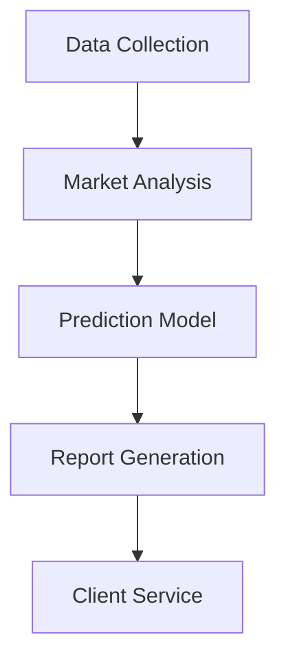

# 🤖 Phidata Multi-Agent Prompt Template

Template for automatically designing and implementing multi-agent AI systems using the Phidata framework

## Project Purpose

[Please describe the project purpose here]

Example: "I want to establish a consulting firm that uses AI for real estate price prediction and market analysis"

## Desired Content
- Organizational structure
- Responsibility scope for each department/role
- Complete set of required AI agents
- Processing flow
- Code implementation

# Output Format

## 1. Organizational Analysis
[LLM analyzes organizational requirements and proposes optimal structure]

### 1.1 Organizational Structure
[Display department composition and hierarchical relationships in tree format]

### 1.2 Roles and Responsibilities
[Detailed responsibility scope for each department and position]

## 2. AI Agent Design
[Identification and design of required AI agents]

### 2.1 Agent Configuration
[Definition of agent types and roles]

### 2.2 Data Flow
[Collaboration between agents and information flow]

## 3. Implementation Code

```python
# Write code implementation here
```

## Implementation Example

The following is an example of output generated by the LLM based on the specified purpose:

````markdown
Input:
"I want to establish a consulting firm that uses AI for real estate price prediction and market analysis"

Output:

## 1. Organizational Analysis

### 1.1 Organizational Structure
```
RealEstate AI Consulting
├── Market Analysis Department
│   ├── Data Science Team
│   └── Market Research Team
├── Consulting Department
│   ├── Client Service Team
│   └── Report Creation Team
└── System Operations Department
    ├── AI Operations Team
    └── Infrastructure Management Team
```

### 1.2 Roles and Responsibilities
- Market Analysis Department
  - Data collection and preprocessing
  - Prediction model development and validation
  - Market trend analysis
- Consulting Department
  - Analysis of client requirements
  - Report creation and proposals
  - Presentations
- System Operations Department
  - Maintenance and operation of AI systems
  - Infrastructure management
  - Security measures

## 2. AI Agent Design

### 2.1 Agent Configuration
- Data Collection Agent
- Market Analysis Agent
- Prediction Model Agent
- Report Generation Agent
- Client Service Agent

### 2.2 Data Flow


## 3. Implementation Code

```python
from phi.agent import Agent
from phi.model.openai import OpenAIChat
from phi.tools.duckduckgo import DuckDuckGo
from phi.tools.yfinance import YFinanceTools
from phi.storage.agent.sqlite import SqlAgentStorage

# Data Collection Agent
data_collector = Agent(
    name="data_collector",
    role="Data Collection Specialist",
    model=OpenAIChat(id="gpt-4"),
    tools=[
        DuckDuckGo(),
        YFinanceTools(enable_all=True)
    ],
    instructions=[
        "Collect real estate market data",
        "Prioritize reliable sources",
        "Perform data preprocessing and formatting"
    ],
    storage=SqlAgentStorage(
        table_name="data_collector",
        db_file="real_estate.db"
    )
)

# Market Analysis Agent
market_analyst = Agent(
    name="market_analyst",
    role="Market Analysis Expert",
    model=OpenAIChat(id="gpt-4"),
    instructions=[
        "Analyze market trends",
        "Identify key metrics",
        "Conduct competitive analysis"
    ],
    storage=SqlAgentStorage(
        table_name="market_analyst",
        db_file="real_estate.db"
    )
)

# Prediction Model Agent
prediction_model = Agent(
    name="prediction_model",
    role="AI Prediction Specialist",
    model=OpenAIChat(id="gpt-4"),
    instructions=[
        "Execute price prediction models",
        "Evaluate prediction accuracy",
        "Propose model optimizations"
    ],
    storage=SqlAgentStorage(
        table_name="prediction_model",
        db_file="real_estate.db"
    )
)

# Report Generation Agent
report_generator = Agent(
    name="report_generator",
    role="Report Creation Expert",
    model=OpenAIChat(id="gpt-4"),
    instructions=[
        "Document analysis results",
        "Create visualization materials",
        "Write proposals"
    ],
    storage=SqlAgentStorage(
        table_name="report_generator",
        db_file="real_estate.db"
    )
)

# Client Service Agent
client_service = Agent(
    name="client_service",
    team=[
        data_collector,
        market_analyst,
        prediction_model,
        report_generator
    ],
    instructions=[
        "Understand client requirements",
        "Explain analysis results",
        "Collect and respond to feedback"
    ],
    storage=SqlAgentStorage(
        table_name="client_service",
        db_file="real_estate.db"
    )
)

# Main System Execution
if __name__ == "__main__":
    client_service.print_response(
        """
        Please analyze the following real estate property:
        - Location: Minato City, Tokyo
        - Type: Commercial Building
        - Budget: 1 billion yen
        - Purpose: Investment
        """,
        stream=True
    )
```
````
