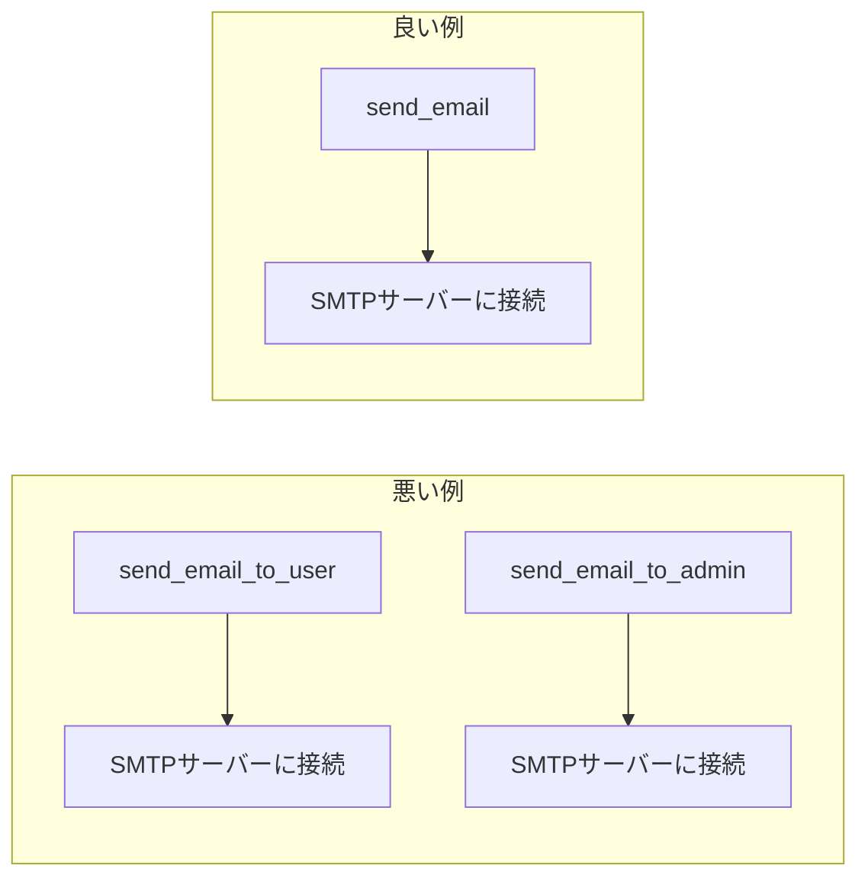
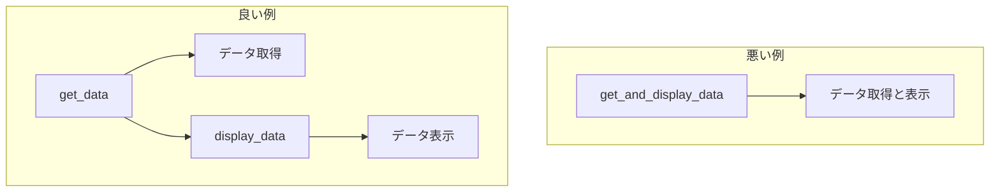
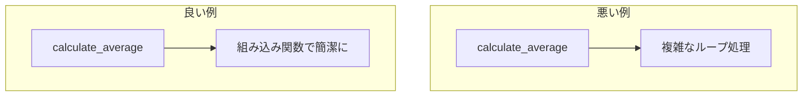
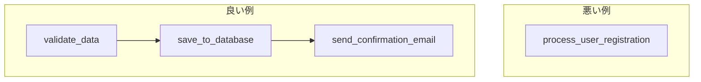
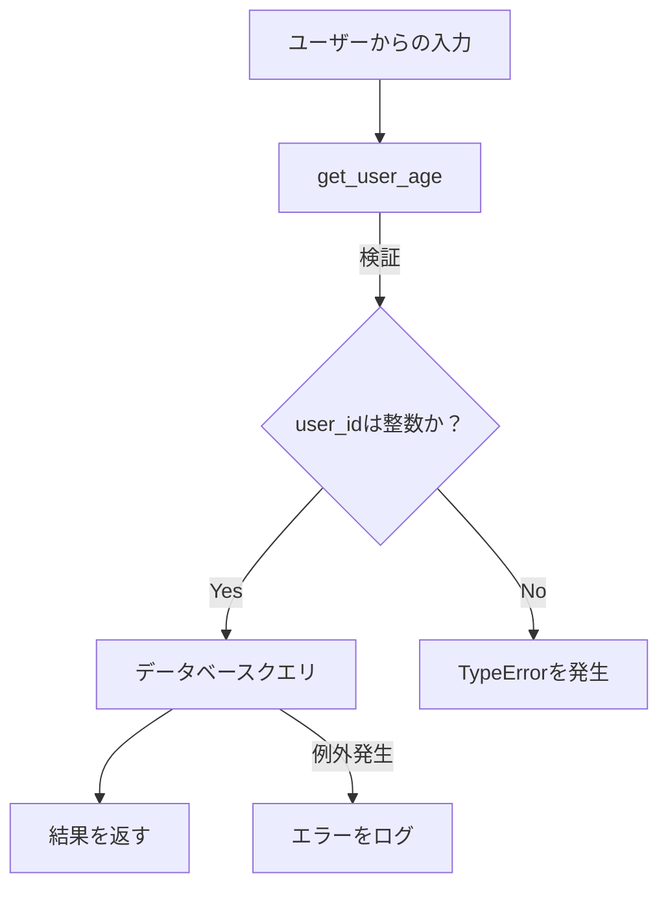

# 要求定義書：最高のプログラミングコード

本要求定義書では、最高のプログラミングコードを作成するための要件を定義します。以下の5つの基本的な考え方に基づき、各要件を詳細に説明し、具体例やMermaidによる可視化を提供します。また、必要に応じて追加の要素も提案します。

---

## ① DRY（Don't Repeat Yourself）

**要件**:

- **コードの再利用性**: 同一または類似のコードを繰り返さず、共通部分は関数やモジュールとして再利用可能な形にまとめること。
- **メンテナンス性向上**: 変更が必要な場合、一箇所を修正するだけで全体に反映されるようにすること。

**具体例**:

```python
# 悪い例：コードの繰り返し
def send_email_to_user(user_email):
    smtp_server = "smtp.example.com"
    port = 587
    # SMTPサーバーに接続してメールを送信するコード
    pass

def send_email_to_admin(admin_email):
    smtp_server = "smtp.example.com"
    port = 587
    # SMTPサーバーに接続してメールを送信するコード
    pass

# 良い例：共通部分を関数にまとめる
def send_email(recipient_email):
    smtp_server = "smtp.example.com"
    port = 587
    # SMTPサーバーに接続してメールを送信するコード
    pass
```

**Mermaidによる可視化**:



---

## ② 責務の分離（Separation of Concerns）

**要件**:

- **モジュール化**: 各関数やクラスは単一の責務に限定し、異なる機能を混在させないこと。
- **可読性と保守性の向上**: コードの構造を明確にし、他の開発者にも理解しやすくすること。

**具体例**:

```python
# 悪い例：データ取得と表示が混在
def get_and_display_data():
    data = get_data_from_database()
    print("Data:", data)

# 良い例：責務を分離
def get_data():
    return get_data_from_database()

def display_data(data):
    print("Data:", data)

# 使用例
data = get_data()
display_data(data)
```

**Mermaidによる可視化**:



---

## ③ KISS（Keep It Simple, Stupid）

**要件**:

- **シンプルさの追求**: コードは可能な限りシンプルにし、不要な複雑性を排除すること。
- **効率的な実装**: 簡潔で明瞭なコードを書くことで、理解とデバッグを容易にすること。

**具体例**:

```python
# 悪い例：複雑なアルゴリズムを自作
def calculate_average(numbers):
    total = 0
    count = 0
    for number in numbers:
        total += number
        count += 1
    average = total / count
    return average

# 良い例：組み込み関数を活用
def calculate_average(numbers):
    return sum(numbers) / len(numbers)
```

**Mermaidによる可視化**:



---

## ④ 分割統治（Divide and Conquer）

**要件**:

- **問題の分割**: 大きな問題を小さな部分に分割し、個別に解決すること。
- **段階的な開発**: 各部分を独立してテスト・デバッグできるようにすること。

**具体例**:

```python
# 悪い例：一つの関数で全てを処理
def process_user_registration(data):
    # データバリデーション
    # データベースへの保存
    # 確認メールの送信
    pass

# 良い例：機能ごとに分割
def validate_data(data):
    pass

def save_to_database(validated_data):
    pass

def send_confirmation_email(user_email):
    pass

# 使用例
validated_data = validate_data(data)
save_to_database(validated_data)
send_confirmation_email(validated_data['email'])
```

**Mermaidによる可視化**:



---

## ⑤ 防御的プログラミング（Defensive Programming）

**要件**:

- **入力の検証**: 関数やメソッドに渡される入力データを常に検証すること。
- **エラーハンドリング**: 予期せぬエラーや例外に対して適切な処理を行うこと。
- **セキュリティ対策**: 潜在的な脆弱性を考慮し、悪意のある入力や攻撃に対する防御策を実装すること。

**具体例**:

```python
# 悪い例：入力の検証なし
def get_user_age(user_id):
    age = database.query("SELECT age FROM users WHERE id = " + user_id)
    return age

# 良い例：入力の検証とエラーハンドリング
def get_user_age(user_id):
    if not isinstance(user_id, int):
        raise TypeError("User ID must be an integer")
    try:
        age = database.query("SELECT age FROM users WHERE id = %s", (user_id,))
        return age
    except DatabaseError as e:
        # ログを記録し、適切なエラーを返す
        log_error(e)
        raise
```

**Mermaidによる可視化**:



---

## 追加の要素

最高のプログラミングコードを作成するために、以下の追加要素も考慮してください。

### ⑥ YAGNI（You Aren't Gonna Need It）

**要件**:

- **不要な機能の排除**: 現在必要でない機能やコードを追加しないこと。
- **シンプルさの維持**: 未来の要件を予測して複雑性を増やさない。

**具体例**:

```python
# 悪い例：将来必要かもしれない機能を追加
def calculate_total(price, tax, discount=0, currency='USD', apply_coupon=False):
    # 複雑な計算処理
    pass

# 良い例：現在の要件に焦点を当てる
def calculate_total(price, tax):
    return price + tax
```

---

### ⑦ コードの可読性とドキュメンテーション

**要件**:

- **明確な命名**: 変数名、関数名、クラス名はその役割を明確に示すものにする。
- **コメントとドキュメンテーション**: 必要に応じてコメントを追加し、コードの目的や動作を説明する。

**具体例**:

```python
# 悪い例：不明瞭な変数名とコメントなし
def f(x):
    return x * 0.05

# 良い例：明確な命名とコメント
def calculate_sales_tax(amount):
    """売上税を計算する関数"""
    return amount * 0.05
```

---

### ⑧ テスト駆動開発（TDD）とユニットテスト

**要件**:

- **ユニットテストの作成**: 各機能に対してテストを作成し、コードの信頼性を高める。
- **テスト駆動開発の推奨**: まずテストを書いてからコードを書くことで、要件に沿った実装を確保する。

**具体例**:

```python
# テストコードの例
import unittest

class TestCalculateTotal(unittest.TestCase):
    def test_calculate_total(self):
        self.assertEqual(calculate_total(100, 5), 105)

if __name__ == '__main__':
    unittest.main()
```

---

### ⑨ バージョン管理とコードレビュー

**要件**:

- **バージョン管理の使用**: Gitなどのバージョン管理システムを使用してコードの変更履歴を管理する。
- **コードレビューの実施**: 他の開発者によるレビューを通じてコードの品質を向上させる。

---

### ⑩ SOLID原則

**要件**:

- **単一責任の原則（Single Responsibility Principle）**: クラスやモジュールは一つの責務を持つべき。
- **オープン・クローズドの原則（Open/Closed Principle）**: ソフトウェアは拡張に対して開いており、変更に対して閉じているべき。
- **リスコフの置換原則（Liskov Substitution Principle）**: 派生クラスは基底クラスと置換可能であるべき。
- **インターフェース分離の原則（Interface Segregation Principle）**: 特定のクライアントに特化した複数の小さなインターフェースを作るべき。
- **依存関係逆転の原則（Dependency Inversion Principle）**: 高水準モジュールは低水準モジュールに依存すべきでない。両者とも抽象に依存すべき。

---

以上の要件定義に基づき、最高のプログラミングコードを作成してください。各要件を満たすことで、効率的でメンテナンス性が高く、信頼性のあるコードが実現できます。

---
